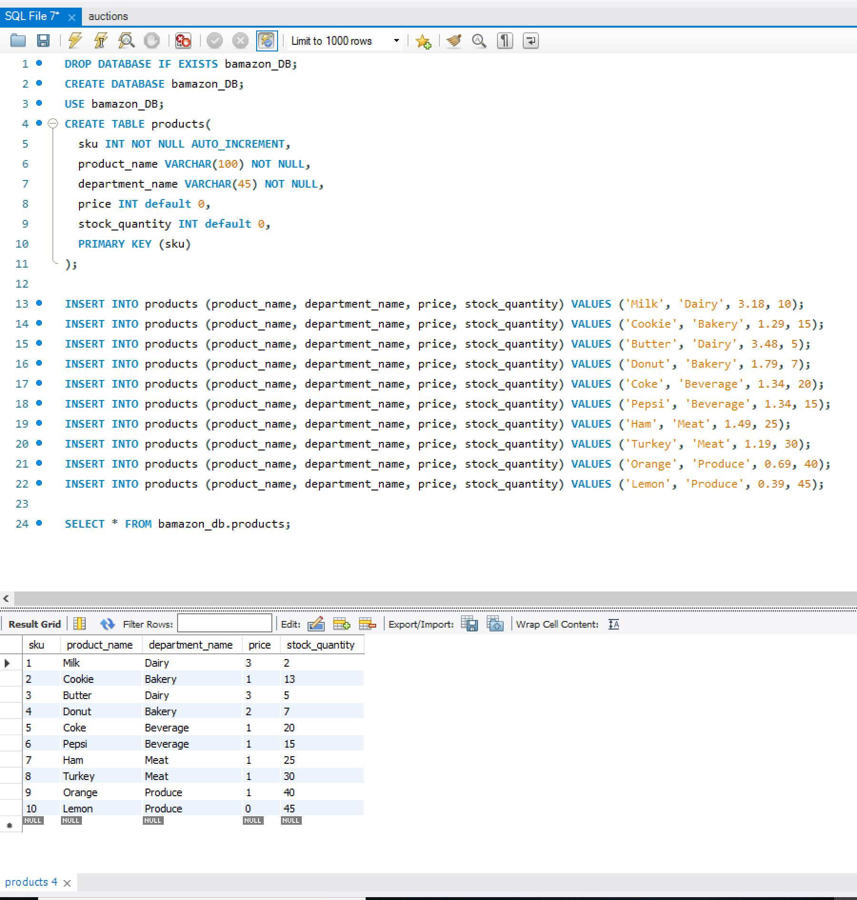
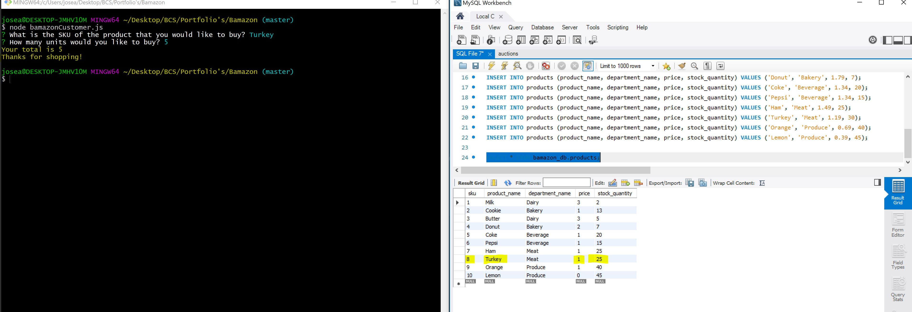
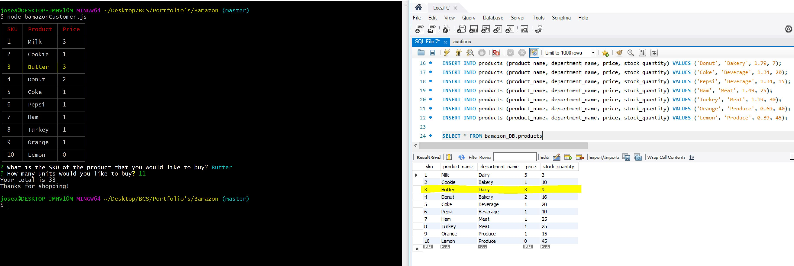
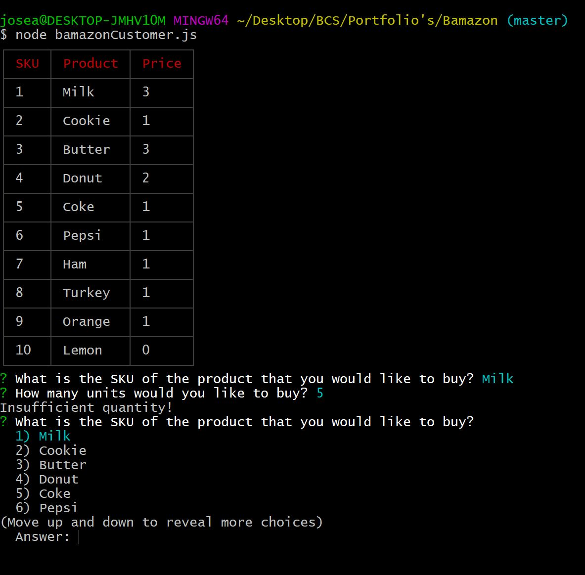
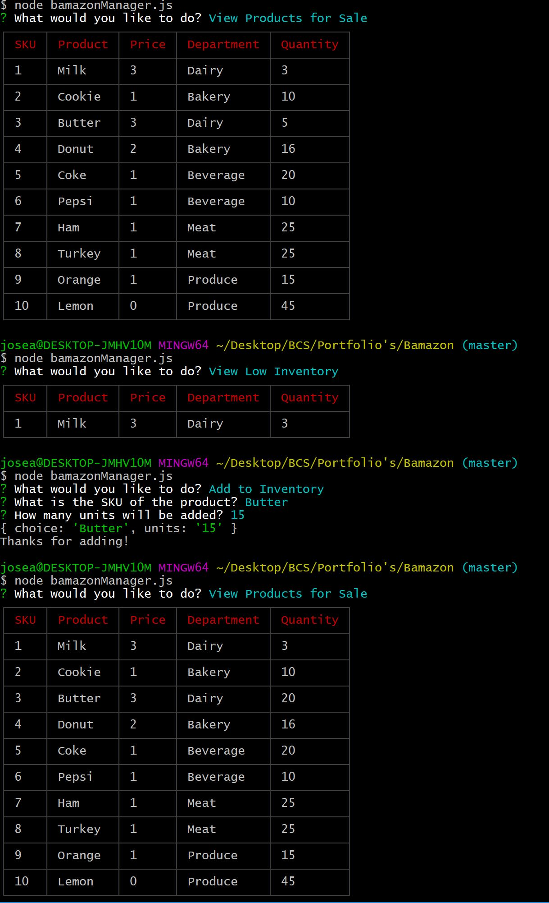
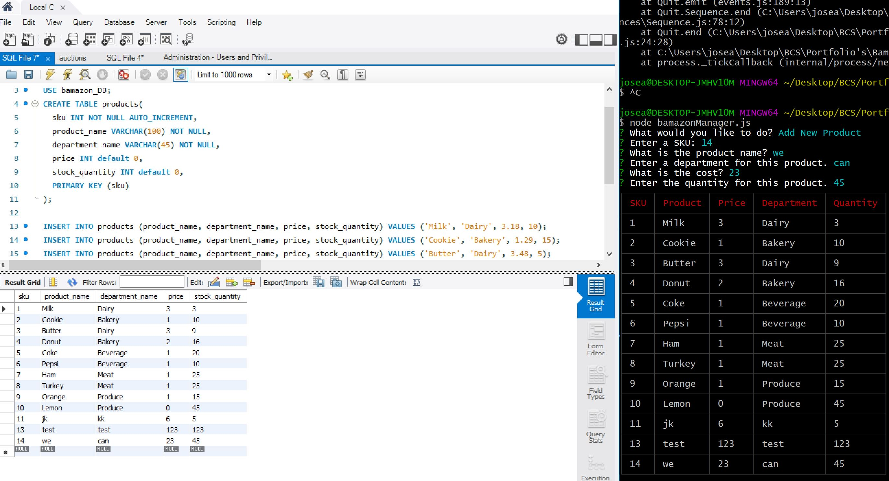

# Node.js-MySQL

## Overview

* In this activity, you'll be creating an Amazon-like storefront with the MySQL skills you learned this unit. The app will take in orders from customers and * * deplete stock from the store's inventory. As a bonus task, you can program your app to track product sales across your store's departments and then provide a * summary of the highest-grossing departments in the store.

Make sure you save and require the MySQL and Inquirer npm packages in your homework files--your app will need them for data input and storage.

## 1. Create a MySQL Database called `bamazon`.

## 2. Then create a Table inside of that database called `products`.

## 3. The products table should have each of the following columns:

   * sku (unique id for each product)

   * product_name (Name of product)

   * department_name

   * price (cost to customer)

   * stock_quantity (how much of the product is available in stores)

## 4. Populate this database with around 10 different products. (i.e. Insert "mock" data rows into this database and table).

   

## 5. Then create a Node application called `bamazonCustomer.js`. Running this application will first display all of the items available for sale. Include the skus, names, and prices of products for sale.

## 6. The app should then prompt users with two messages.

   * The first should ask them the SKU of the product they would like to buy.
   * The second message should ask how many units of the product they would like to buy.

## 7. If your store _does_ have enough of the product, you should fulfill the customer's order.
   * This means updating the SQL database to reflect the remaining quantity.
   * Once the update goes through, show the customer the total cost of their purchase.
   
   
   

## 8. Once the customer has placed the order, your application should check if your store has enough of the product to meet the customer's request.

   * If not, the app should log a phrase like `Insufficient quantity!`, and then prevent the order from going through.

   

### Challenge #2: Manager View (Next Level)

* Create a new Node application called `bamazonManager.js`. Running this application will:

  * List a set of menu options:
    * View Products for Sale
    * View Low Inventory
    * Add to Inventory
    * Add New Product

  * If a manager selects `View Products for Sale`, the app should list every available item: the item SKUs, names, prices, and quantities.

  * If a manager selects `View Low Inventory`, then it should list all items with an inventory count lower than five.

  * If a manager selects `Add to Inventory`, your app should display a prompt that will let the manager "add more" of any item currently in the store.

## 5/20/19
  * If a manager selects `Add New Product`, it should allow the manager to add a completely new product to the store.

- - -

* If you finished Challenge #2 and put in all the hours you were willing to spend on this activity, then rest easy! Otherwise continue to the next and final challenge.
